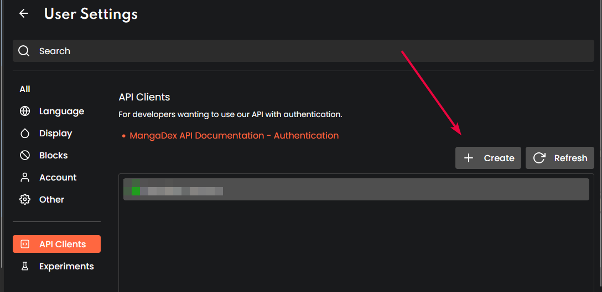
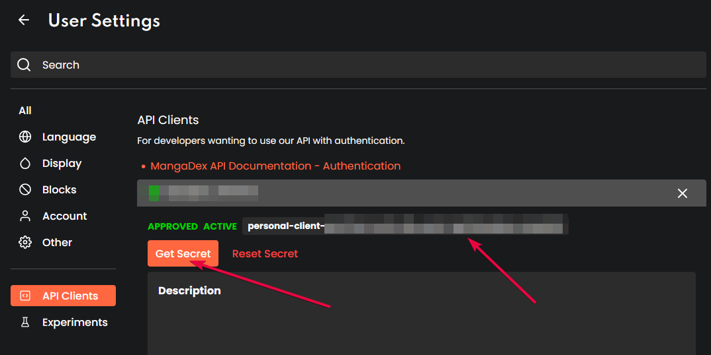

    <h1 align="center">
        <a href="https://jisho.org/word/%E6%9C%AC%E6%A3%9A">Hondana 『本棚』</a>
         
        
    </h1>
    
    
    

    

<h1></h1>
 

A lightweight and asynchronous wrapper around the [MangaDex v5 API](https://api.mangadex.org/docs.html).
You can see our stable docs [here](https://hondana.readthedocs.io/en/stable/)!

---

## Features

We are currently at 100% feature compliance with the API.

## Examples

Please take a look at the [examples](./examples/) directory for working examples.

**NOTE**: More examples will follow as the library is developed.

### Current caveats to note

- There are no API endpoints for Artist. It seems they are not differentiated from Author types except in name only.
  - I have separated them logically, but under the hood all Artists are Authors and their `__eq__` reports as such.
- The tags and report reasons are locally cached since you **must** pass UUIDs to the api (and I do not think you're going to memorize those), there's a convenience method for updating the local cache as `Client.update_tags` and `Client.update_report_reasons` respectively.
  - I have added [an example](./examples/updating_local_tags.py) on how to do the above for tags.
  - To use these tags, you can see an example [here](./examples/search_manga.py#L17-L22).
- [Settings related endpoints](https://api.mangadex.org/docs.html#operation/get-settings-template) are not currently exposed. I have implemented their documented use, but I do not expect them to currently function.
  - Once this is exposed fully I will implement a richer interface.
- Currently, if there are any errors in a chapter upload process, the error key does not contain filenames or identifiable information on exactly what file failed upload.
  - This means that I locally compare the succeeded files with the ones missing from the full response payload. The examples have been updated with how to check for an error.
- Currently, the `Client.my_chapter_read_history` method will not work. It is disabled on MD's side due to an issue they had previously. If/when it is re-introduced the method will remain the same.

### Further information/tidbits

- For a bit more clarity on a Chapter's `readableAt` vs `publishAt`, see [this page](https://api.mangadex.org/docs/dates/#readableat) on the MangaDex docs.
- A query with the `include_future_updates` bool set to `True` will include chapters that are pending release by scanlation groups on MangaDex, but which may be available on their sites.

### How to request your own personal OAuth2 Client.

For authentication with `hondana` to work, you'll need to create and request your own personal OAuth2 client within the MangaDex web portal.
This can be done [here](https://mangadex.org/settings) (under the "API Clients" section).

Within here you'll want to hit "Create":-

Fill out the relevant name and description of the api client, and hit "Create" once again.

This is currently (as of 10th Nov 2023) still a manual review and approval process by the MangaDex team, so check back regularly to find out if your client is active or still awaiting review.

Once it is active, you can fetch it's client id and client secret:-

You then pass this information to the `hondana.Client` constructor alongside your username and password for MangaDex, as this will be used to authenticate you within the API.

### Contributing

If you would like to contribute to Hondana, please take a look at [the contributing guidelines](./.github/CONTRIBUTING.md) and follow the procedure there.

If you have any question please feel free to join my Discord server:

    

